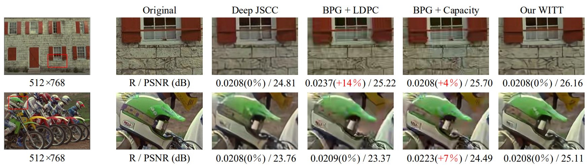

# WITT: A Wireless Image Transmission Transformer For Semantic Communication

Pytorch implementation of the [paper](https://arxiv.org/abs/2211.00937) "WITT: A Wireless Image Transmission Transformer For Semantic Communications".

## Introduction
In this paper, we aim to redesign the vision Transformer (ViT) as a new backbone to realize semantic image transmission, termed wireless image transmission transformer (WITT). Previous works build upon convolutional neural networks (CNNs), which are inefficient in capturing global dependencies, resulting in degraded end-to-end transmission performance especially for high-resolution images. To tackle this, the proposed WITT employs Swin Transformers as a more capable backbone to extract long-range information. Different from ViTs in image classification tasks, WITT is highly optimized for image transmission while considering the effect of the wireless channel. Specifically, we propose a spatial modulation module to scale the latent representations according to channel state information, which enhances the ability of a single model to deal with various channel conditions. As a result, extensive experiments verify that our WITT attains better performance for different image resolutions, distortion metrics, and channel conditions. All pretrain models can be found in [Baidu netdisk](https://pan.baidu.com/s/13_Lb8wFVio9PFU4jiySrhA (password:hxzo))(password:hxzo) or [Google drive](https://drive.google.com/drive/folders/1YdnShbfIT03p_e30vjkV2wPKYOQPmUWp?usp=share_link).


>  The overall architecture of the proposed WITT scheme for wireless image transmission.

## Experimental results

* we employ the BPG codec for compression combined with 5G LDPC codes for channel coding (marked as “BPG + LDPC”). Here, we considered 5G LDPC codes with a block length of 6144 bits for different coding rates and quadrature amplitude modulations (QAM). 
* the ideal capacity-achieving channel code is also considered during evaluation (marked as “BPG + Capacity”).

>  We show the examples of visual comparison under AWGN channel at SNR = 10dB. More experimental results show in [results](./results).

# Installation
We implement WITT under python 3.8 and PyTorch 1.9. 


# Usage

## Train

* cbr = C/(2^(2i)*3*2), i denotes the downsample number. For CIFAR10, i=2; for HR_image, i=4.
* WITT_W/O model is the WITT model without Channel ModNet module which is trained on a fixed channel state (SNR).
* 'multiple-snr' decides use either fixed or random SNR to train the model. For WITT_W/O model, 'multiple-snr' is set as a fixed SNR. For WITT model, 'muliple-snr' can be set as both fixed or random SNR.
* for high-resolution images, we can firstly train the WITT_W/O model. Then, the WITT_W/O model is used as a pre-training model to train the whole WITT model.
```
python train.py --training --trainset {CIFAR10/DIV2K} --testset {CIFAR10/kodak/CLIC21} -- distortion-metric {MSE/MS-SSIM} --model {'WITT'/'WITT_W/O'} --channel-type {awgn/rayleigh} --C {bottleneck dimension} --multiple-snr {random or fixed snr}
```

### For WITT model 

*e.g. cbr = 0.0625, snr = [1, 4, 7, 10, 13], metric = PSNR, channel = AWGN

```
e.g.
python train.py --training --trainset DIV2K --testset kodak -- distortion-metric MSE --model WITT --channel-type awgn --C 96 -- multiple-snr 1,4,7,10,13
```

You can apply our method on your own images.

### For WITT_W/O model 

*e.g. cbr = 0.0625, snr = [1], metric = PSNR, channel = AWGN

```
e.g.
python train.py --training --trainset DIV2K --testset kodak --distortion-metric MSE --model WITT_W/O --channel-type awgn --C 96 --multiple-snr 1
```


## Test
All pretrain models can be found in [Baidu netdisk](https://pan.baidu.com/s/13_Lb8wFVio9PFU4jiySrhA (password:hxzo))(password:hxzo) or [Google drive](https://drive.google.com/drive/folders/1xry4pm8CIW4AVpU8t6gAGKFnsnWjApk9?usp=share_link).

```
python train.py --trainset {CIFAR10/DIV2K} --testset {CIFAR10/kodak/CLIC21} -- distortion-metric {MSE/MS-SSIM} --model {'WITT'/'WITT_W/O'} --channel-type {awgn/rayleigh} --C {bottleneck dimension} --multiple-snr {random or fixed snr}
```

### For WITT model 

*e.g. cbr = 0.0625, snr = [1, 4, 7, 10, 13], metric = PSNR, channel = AWGN

```
e.g.
python train.py --trainset DIV2K --testset kodak --distortion-metric MSE --model WITT --channel-type awgn --C 96 --multiple-snr 1,4,7,10,13
```

You can apply our method on your own images.

### For WITT_W/O model 

*e.g. cbr = 0.0625, snr = [1], metric = PSNR, channel = AWGN

```
e.g.
python train.py --trainset DIV2K --testset kodak --distortion-metric MSE --model WITT_W/O --channel-type awgn --C 96 --multiple-snr 1
```

# Citation

If you find this work useful for your research, please cite:

@inproceedings{yang2023witt,   
  title={{WITT}: A wireless image transmission transformer for semantic communications},   
  author={Yang, Ke and Wang, Sixian and Dai, Jincheng and Tan, Kailin and Niu, Kai and Zhang, Ping},   
  booktitle={ICASSP 2023-2023 IEEE International Conference on Acoustics, Speech and Signal Processing (ICASSP)},   
  pages={1--5},   
  year={2023},   
  organization={IEEE}   
}

# Acknowledgement
The implementation is based on [Swin Transformer](https://github.com/microsoft/Swin-Transformer).

# Related links
* BPG image format by _Fabrice Bellard_: https://bellard.org/bpg
* Sionna An Open-Source Library for Next-Generation Physical Layer Research: https://github.com/NVlabs/sionna
* DIV2K image dataset: https://data.vision.ee.ethz.ch/cvl/DIV2K/
* Kodak image dataset: http://r0k.us/graphics/kodak/
* CLIC image dataset:  http://compression.cc
